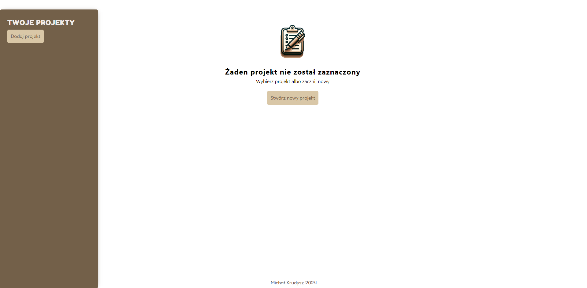
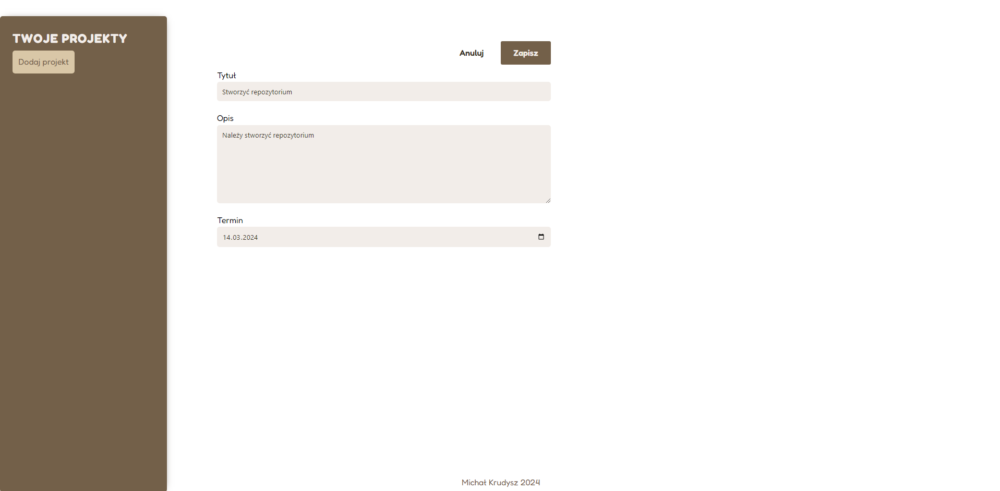
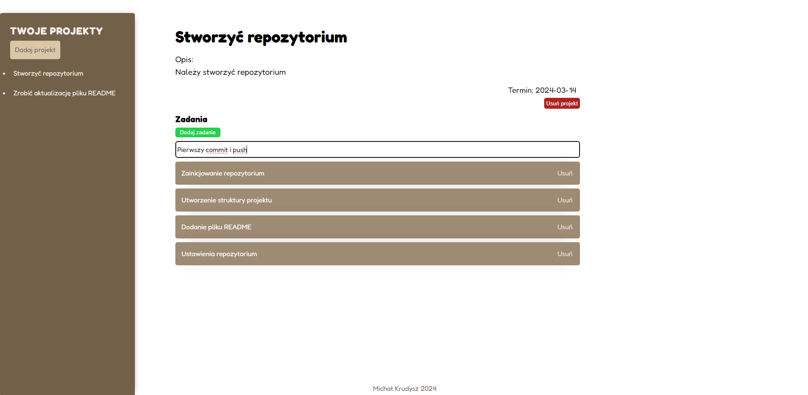
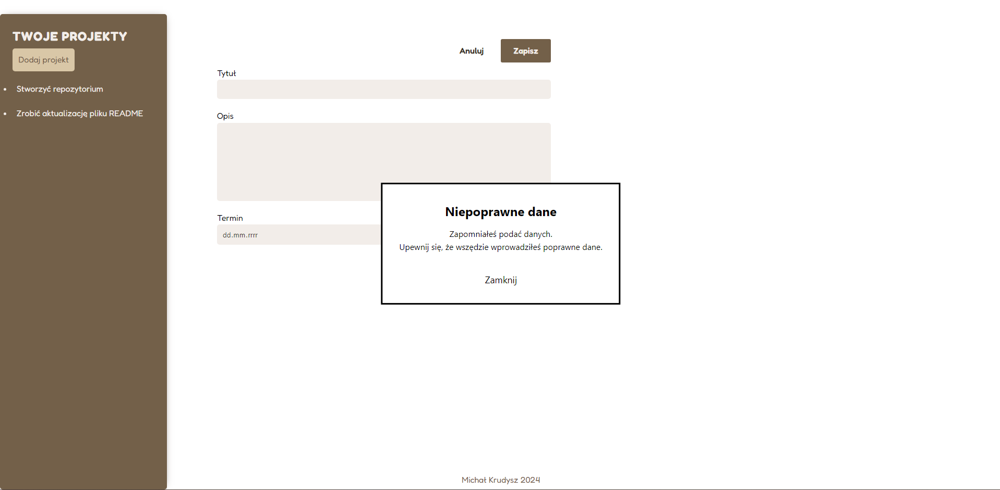

# Project Management Application

## Brief Description

A project management application built using React, allows for the creation of new projects, adding tasks to these projects, and managing these tasks through adding and removing. The interface includes a sidebar for easy navigation between projects, a detailed view of each project along with its tasks, and forms for adding new projects or tasks. The project was done for the purpose of learning React. It is not responsive.

## Technologies

- React
- SCSS (Modules)
- React hooks (useState, useRef, useImperativeHandle, forwardRef)
- ReactDOM (ReactDOM.createPortal)

## Features

- **Project Creation**: You can add new projects with a title, description, and deadline.
- **Task Management**: Within each project, you can add, delete, and view tasks.
- **Form Validation**: Basic form validation to make sure that the entered data is correct. An error appears in the form of a modal window.
- **Intuitive UI**: The application has a sidebar for selecting projects and a main area for displaying details of the selected project and tasks.

The application leverages SCSS for styling, organized using modules to encapsulate styles and avoid clashes.

## App Screenshots

### Main Application Screen

### New Project Creation Window

### Creating a Task in a Selected Project

### Error Message Window When Filling Out a Form

## Pre-installation Requirements

A Node.js environment is required to run the application locally. To set up the project:

1. Clone the project repository.
2. Navigate to the project directory and run `npm install` to install dependencies.
3. Execute `npm run dev` to start the application in development mode.
